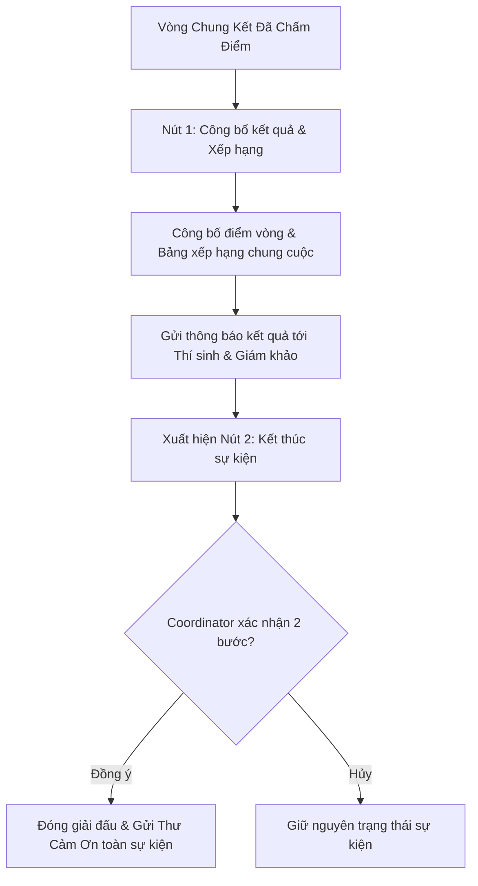

# 📚 TÀI LIỆU QUY TRÌNH & LUỒNG XỬ LÝ MỚI - HỆ THỐNG SEAL HACKATHON

> **Ngày cập nhật**: 29/07/2026  
> **Phiên bản**: 2.0 (Đã hoàn tất kiểm thử & Merge vào nhánh `main`)

---

## 1. 👥 Quy Trình Đội Thi & Tự Động Giải Tán Đội Chưa Chính Thức

### 1.1. Phân loại Đội Thi
* **Đội chưa chính thức (Ineligible Team)**: Là đội thi có số lượng thành viên chính thức **dưới 3 người** (ví dụ: chỉ có 1 Leader, hoặc 1 Leader + 1 Member).
* **Đội chính thức (Official Team)**: Đội thi đạt từ **3 đến 5 thành viên**.

### 1.2. Hạn chế đối với Đội Chưa Chính Thức
* **Khóa quyền nộp bài dự thi**: Trong thời gian diễn ra sự kiện, nếu đội chưa đủ 3 thành viên, nút nộp bài sẽ bị vô hiệu hóa (`disabled`) và hiển thị cảnh báo:
  > ⚠️ *"Đội thi của bạn chưa đủ điều kiện (tối thiểu 3 thành viên chính thức) để nộp bài dự thi."*
* **Bảo vệ API Backend (`SubmissionService.java`)**: Chặn trực tiếp yêu cầu nộp bài nếu `memberCount < 3`.

### 1.3. Cơ chế Tự động Giải tán khi Hết hạn Đăng ký (`regEndDate`)
* **Tiến trình chạy ngầm (`DeadlineNotificationScheduler.java`)**: Chạy định kỳ mỗi 15 giây.
* **Quy trình tự động**:
  1. Quét tất cả các giải đấu đã vượt quá thời gian đăng ký (`now > event.regEndDate`).
  2. Tìm toàn bộ các đội thi vẫn còn là **Đội chưa chính thức** (`< 3 thành viên`).
  3. Thực hiện giải tán đội (`disbandTeam`): Xóa dữ liệu liên kết đội, giải phóng thành viên.
  4. Gửi **Thông báo khẩn** trực tiếp đến quả chuông thông báo của từng thành viên:
     * **Tiêu đề**: `⚠️ Thông báo giải tán đội [Tên Đội]`
     * **Nội dung**: `Đội thi "[Tên Đội]" của bạn bị buộc giải tán do chưa đạt tối thiểu 3 thành viên chính thức khi thời hạn đăng ký giải đấu "[Tên Sự Kiện]" kết thúc.`

---

## 2. 🛡️ Quy Trình Loại Đội Thi & Cập Nhật Real-Time

### 2.1. Chuẩn hóa Audit Log khi Loại Đội
* Khi Giám khảo hoặc Coordinator bấm **Loại đội thi**:
  * Không ghi chênh lệch *"Điểm cũ - Điểm mới"* vào Audit Log (tránh gây hiểu lầm dữ liệu điểm trước khi loại).
  * Ghi nhận rõ ràng **Lý do loại đội** và **Tài khoản thực hiện**.

### 2.2. Cập nhật Thông báo Trực thời (Real-time Notification)
* Hệ thống trang Giám khảo (`Grading.jsx`) có cơ chế làm mới chạy ngầm 4 giây/lần (`fetchDataQuiet`).
* Khi một đội thi bị loại, tất cả các Giám khảo đang mở màn hình chấm điểm sẽ lập tức thấy thông báo đội thi bị loại mà **không cần bấm F5 / Reload trang**.

---

## 3. 🔄 Luồng Chuyển Vòng Đấu & Xếp Hạng (Round Advancement)

### 3.1. Các Vòng Đấu Thông Thường (Vòng Sơ Loại, Vòng Bán Kết)
* **Nút điều khiển**: `⚡ Công bố kết quả & Mở Vòng mới`
* **Hành vi**:
  1. Kiểm tra trạng thái chấm điểm của các bài thi thuộc Vòng.
  2. Lấy danh sách **Top N** bài thi có điểm cao nhất theo từng Track.
  3. Tự động chuyển các đội xuất sắc lên Vòng đấu kế tiếp.
  4. Gửi thông báo chuyển vòng cho Thí sinh và Giám khảo.

### 3.2. Vòng Chung Kết (Final Round - Luồng 2 Nút Độc Lập)
Ở Vòng Chung Kết, hệ thống **không bắt buộc cấu hình vòng tiếp theo** và tách thành 2 nút bấm với luồng nghiệp vụ riêng biệt:

#### 📌 Nút 1: `🏆 Công bố kết quả & Xếp hạng`
* **Thời điểm xuất hiện**: Trước khi công bố kết quả Vòng Chung Kết.
* **Chức năng**:
  * Đánh dấu công bố kết quả Vòng Chung Kết (`matrix.isPublished = true`).
  * Tính toán và công bố **Bảng xếp hạng chung cuộc của toàn giải đấu**.
  * Gửi thông báo thứ hạng chi tiết về chuông thông báo của Thí sinh và Giám khảo.

#### 📌 Nút 2: `🏁 Kết thúc sự kiện`
* **Thời điểm xuất hiện**: **Chỉ hiển thị sau khi Nút 1 đã được bấm công bố**.
* **Chức năng**:
  * Hiển thị hộp thoại xác nhận 2 bước để Coordinator kiểm tra lại lần cuối.
  * Khi Coordinator bấm Xác nhận:
    * Cập nhật trạng thái giải đấu thành đã kết thúc (`endedEarly = true`, `active = false`).
    * Tự động gửi **Thư cảm ơn từ Ban Tổ Chức** (`💌 Thư cảm ơn từ Ban Tổ Chức [Tên Sự Kiện]`) đến **toàn bộ Giám khảo, Mentor và Thí sinh** đã tham gia sự kiện.

---

## 4. 🔒 Bảo Vệ Đóng Băng Điểm Số (Score Lock Guards)

Sau khi Coordinator bấm công bố kết quả của một vòng đấu, điểm số sẽ được khóa tuyệt đối:

### 4.1. Khóa ở tầng Backend (`ScoreService.java`)
* Khi có bất kỳ request tạo hoặc cập nhật điểm số cho bài thi thuộc matrix đã công bố (`matrix.isPublished == true`):
* Backend lập tức chặn và trả về lỗi:
  > ❌ **`RuntimeException`**: *"Kết quả vòng đấu đã được công bố, không thể tạo hoặc chỉnh sửa điểm"*

### 4.2. Khóa ở tầng Frontend (`Grading.jsx`)
* Khi Giám khảo mở bài thi thuộc vòng đã công bố:
  * Toàn bộ các ô nhập **Điểm tiêu chí**, **Nhận xét** và nút **Cập nhật điểm** tự động chuyển sang trạng thái `disabled`.
  * Hiển thị bảng thông báo khóa điểm màu ghi:
    > 🔒 **`Kết quả vòng đấu đã được công bố - Điểm số đã bị khóa và không thể chỉnh sửa.`**

---

## 📁 Danh Sách File Đã Cập Nhật

| Thành phần | Đường dẫn File | Mô tả thay đổi |
| :--- | :--- | :--- |
| **Backend Controller** | [RoundAdvancementController.java](file:///d:/SWP/Seal_Hackathon/shm-backend/src/main/java/com/backend/controller/RoundAdvancementController.java) | Bỏ qua validate vòng tiếp theo đối với Vòng Chung Kết; gửi thông báo xếp hạng. |
| **Backend Service** | [EventService.java](file:///d:/SWP/Seal_Hackathon/shm-backend/src/main/java/com/backend/service/EventService.java) | Thêm logic gửi thư cảm ơn khi kết thúc sự kiện. |
| **Backend Service** | [TeamService.java](file:///d:/SWP/Seal_Hackathon/shm-backend/src/main/java/com/backend/service/TeamService.java) | Bổ sung nội dung thông báo giải tán đội chưa đủ 3 thành viên. |
| **Backend Scheduler** | [DeadlineNotificationScheduler.java](file:///d:/SWP/Seal_Hackathon/shm-backend/src/main/java/com/backend/service/DeadlineNotificationScheduler.java) | Thêm scheduled job chạy mỗi 15s tự động giải tán đội chưa đủ thành viên khi hết hạn đăng ký. |
| **Frontend UI** | [EventManagement.jsx](file:///d:/SWP/Seal_Hackathon/shm-frontend/src/pages/EventManagement.jsx) | Cập nhật giao diện 2 nút phân biệt ở Vòng Chung Kết và popup xác nhận kết thúc sự kiện. |
| **Frontend UI** | [Grading.jsx](file:///d:/SWP/Seal_Hackathon/shm-frontend/src/pages/Grading.jsx) | Thêm kiểm tra `isPublished` để vô hiệu hóa form chấm điểm và hiện banner khóa điểm. |
